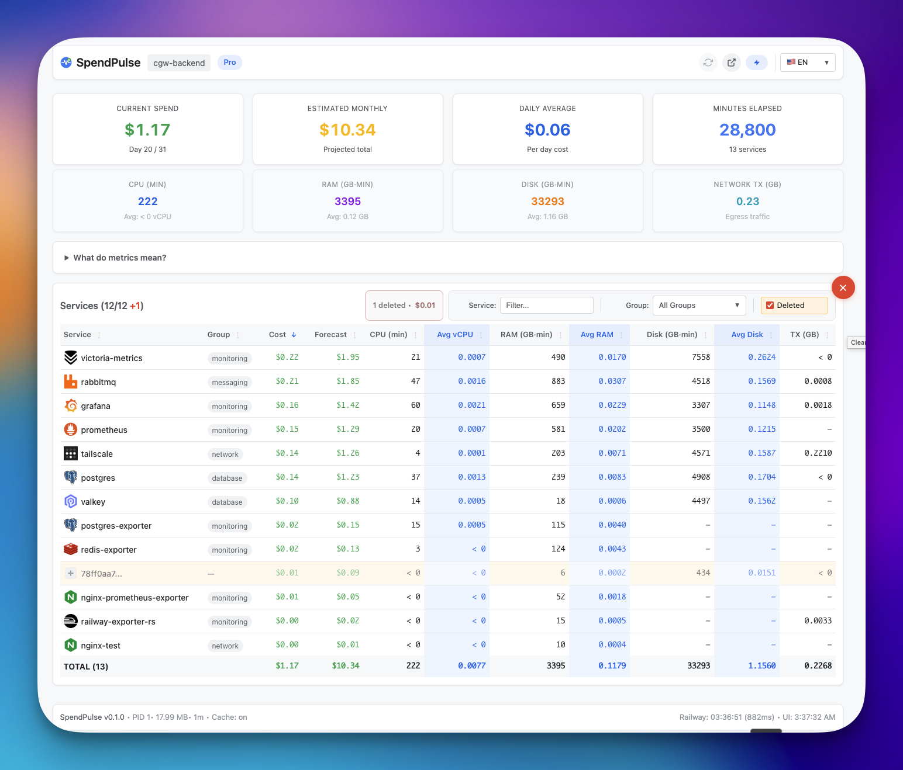
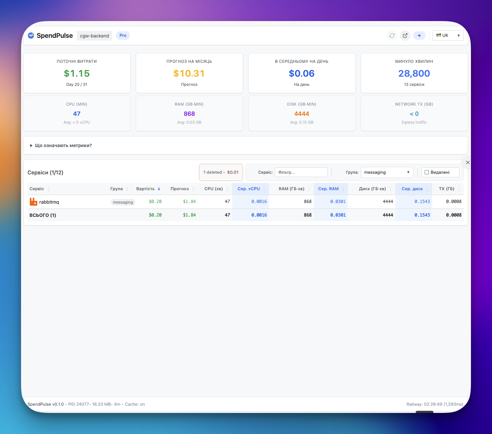
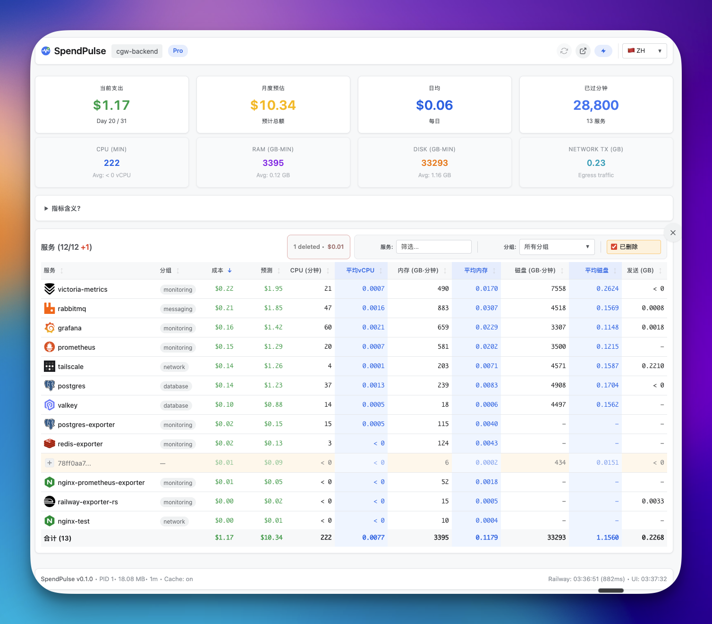
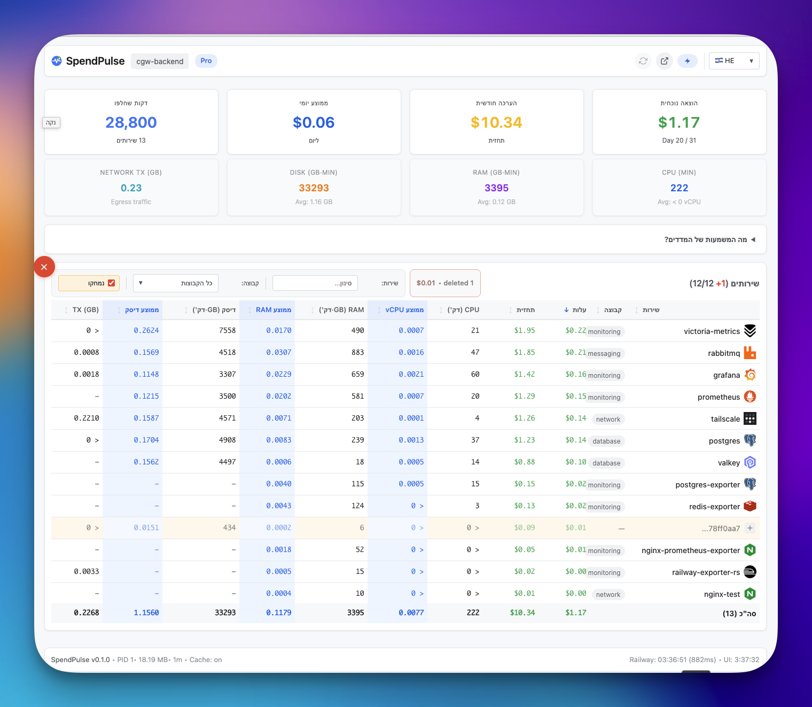

# Changelog

All notable changes to Railway Exporter will be documented in this file.

The format is based on [Keep a Changelog](https://keepachangelog.com/en/1.1.0/),
and this project adheres to [Semantic Versioning](https://semver.org/spec/v2.0.0.html).

## [0.2.0] - 2026-01-20

### 🎉 Highlights

This release transforms Railway Exporter into a complete **all-in-one monitoring solution**.
A single 8MB Docker image now serves both the Rust API backend and the SpendPulse Dashboard
frontend — no separate services required.

### Added

#### Combined Docker Image
- **Single-container deployment** — Backend (Rust) + Frontend (Next.js) in one 8MB image
- **Static file serving** — Built-in handler serves the dashboard from `/static`
- **SPA routing support** — Automatic fallback to `index.html` for client-side routes
- **Multi-stage build** — `scratch` base image for minimal attack surface

#### Static File Handler (`/static/*`)
- Serves Next.js static export from `/static` directory
- MIME type detection for 20+ file types (HTML, CSS, JS, images, fonts, etc.)
- Directory traversal protection (blocks `..` in paths)
- Cache headers (`Cache-Control: public, max-age=3600`)
- SPA fallback for paths without file extensions

#### Icon Endpoint Changes
- **New path**: `/icons/services/{name}` (was `/static/icons/services/{name}`)
- Relative URL support via empty `base_url` config
- Works correctly regardless of external port mapping

### Changed

#### Frontend (SpendPulse Dashboard)
- **WebSocket enabled by default** — Falls back to polling only if server disables WS
- Static export mode for combined image (CSR-only, no SSR)
- API host detection from `window.location.host`

#### Configuration
- `icon_cache.base_url` now defaults to `""` for relative paths
- Relative paths work with any port mapping (e.g., container 9090 → host 9334)

### Fixed

- Icon URLs now work correctly with Docker port mapping
- WebSocket toggle starts in correct state based on server capabilities

### Technical Details

#### Image Sizes
| Image | Size | Contents |
|-------|------|----------|
| `railway-exporter` | 7.14 MB | Backend only (API + metrics) |
| `railway-exporter-combined` | 8.05 MB | Backend + Dashboard |

#### Dockerfile Structure
```
Dockerfile.combined
├── Stage 1: node:22-alpine (build dashboard)
├── Stage 2: rust:1.83-alpine (build backend)
└── Stage 3: scratch (final image)
    ├── /railway-exporter (Rust binary)
    ├── /static/* (Next.js export)
    └── /etc/ssl/certs/* (CA certificates)
```

#### Test Coverage (Backend)
- **169 total tests** (unit + integration)
- 15 new tests for static file handler
- MIME type detection tests
- Directory traversal security tests
- Handler behavior tests
- WebSocket connection/broadcast tests
- HTTP server integration tests
- Icon caching tests

> **Note**: Frontend (Next.js) test coverage to be added in future release.

---

## [0.1.0] - 2026-01-15

### 🚀 Initial Release

First public release of Railway Exporter — a high-performance Prometheus exporter
for Railway.app billing and usage metrics, written in Rust.

### Features

#### Core Metrics
- **Project-level metrics**: Total cost, estimated monthly, daily average
- **Service-level metrics**: CPU, memory, disk, network usage and costs
- **Real-time updates**: Configurable scrape interval (default: 5 minutes)

#### Multiple Output Formats
- **Prometheus** (`/metrics`) — Native Prometheus text format
- **JSON** (`/metrics` with `Accept: application/json`) — Structured JSON for dashboards
- **WebSocket** (`/ws`) — Real-time push updates

#### API Endpoints
| Endpoint | Description |
|----------|-------------|
| `/metrics` | Prometheus metrics (or JSON with Accept header) |
| `/status` | Server status, config, process info |
| `/health` | Health check endpoint |
| `/ws` | WebSocket for real-time updates |

#### Icon Caching
- LRU cache for service icons
- Configurable capacity (`icon_cache.max_count`)
- Two modes: `base64` (embed in JSON) or `link` (serve from endpoint)
- Browser caching with configurable `max_age`

#### Performance
- **Gzip compression** — Configurable min size and level
- **CORS support** — Configurable via `cors_enabled`
- **Minimal memory footprint** — ~10MB RSS typical

#### Configuration
- YAML config file (`config.yaml`)
- Environment variable override (`CONFIG_BASE64`)
- Service groups for organizing services
- Pricing for Hobby and Pro plans

### Technical Stack

- **Language**: Rust 1.83+
- **HTTP Server**: hyper 1.x (no framework overhead)
- **WebSocket**: tokio-tungstenite
- **Metrics**: prometheus crate
- **Compression**: flate2 (gzip)
- **Memory allocator**: jemalloc (Linux), system (macOS)

### Docker Support

- Multi-stage build with `scratch` base
- ~7MB final image size
- Static linking with musl
- OpenSSL for HTTPS to Railway API

### Testing

- 154 unit tests
- Integration tests for HTTP server
- WebSocket connection tests
- Comprehensive handler tests

---

## Development History

### Phase 1: Core Backend (January 2026)
- Prometheus exporter implementation
- Railway API integration (GraphQL)
- Multi-format output (Prometheus, JSON)

### Phase 2: Real-time Features
- WebSocket support for live updates
- Broadcast mechanism for all clients
- Status updates every 5 seconds

### Phase 3: Performance & Polish
- Gzip compression
- Icon caching with LRU eviction
- Process info in status endpoint

### Phase 4: SpendPulse Dashboard
- Next.js 15 frontend
- Multi-language support (EN, RU, UK, HE, ZH)
- RTL support (Hebrew)
- Real-time cost visualization
- Service grouping and filtering






### Phase 5: Combined Image (Current)
- Static file serving in Rust
- Single-container deployment
- 8MB all-in-one image
