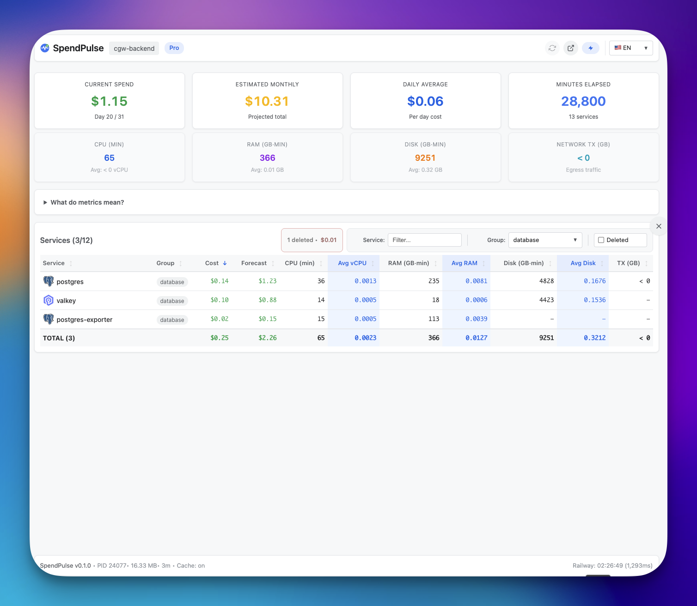
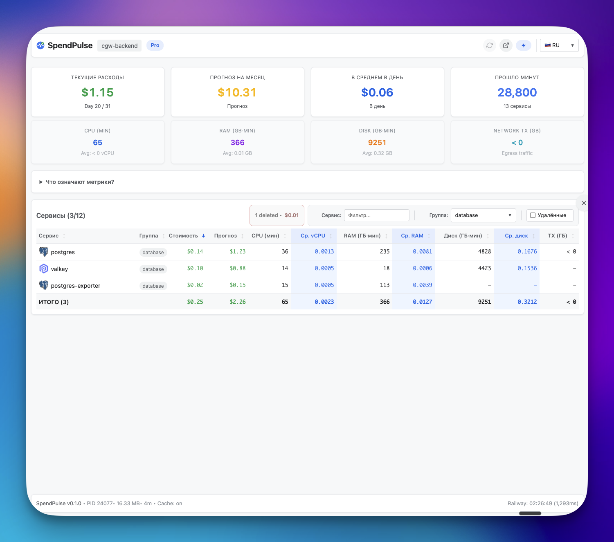
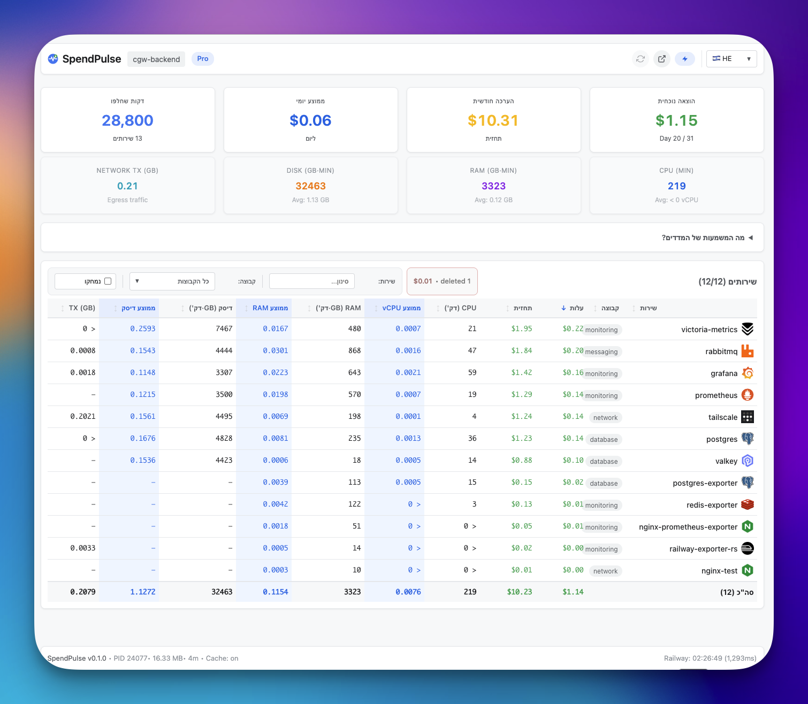
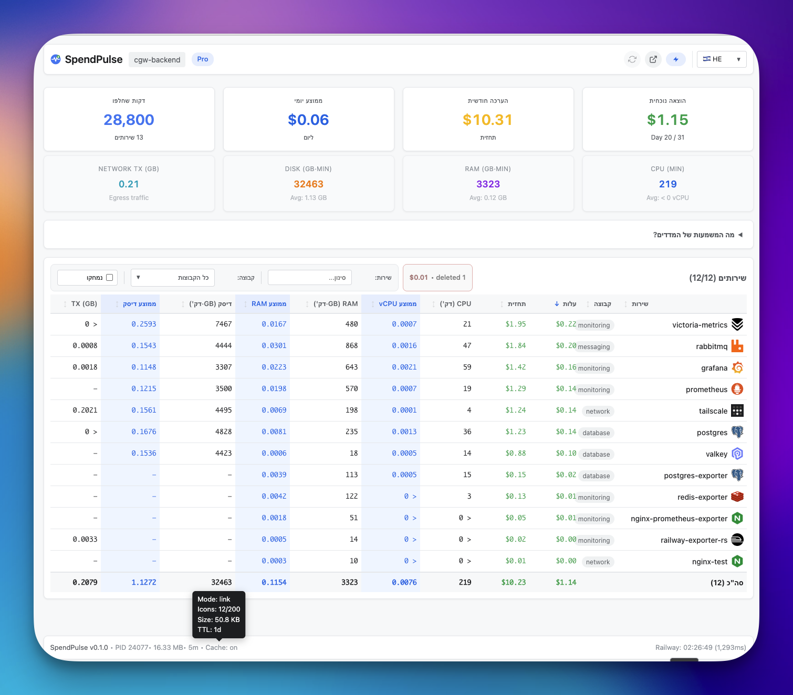
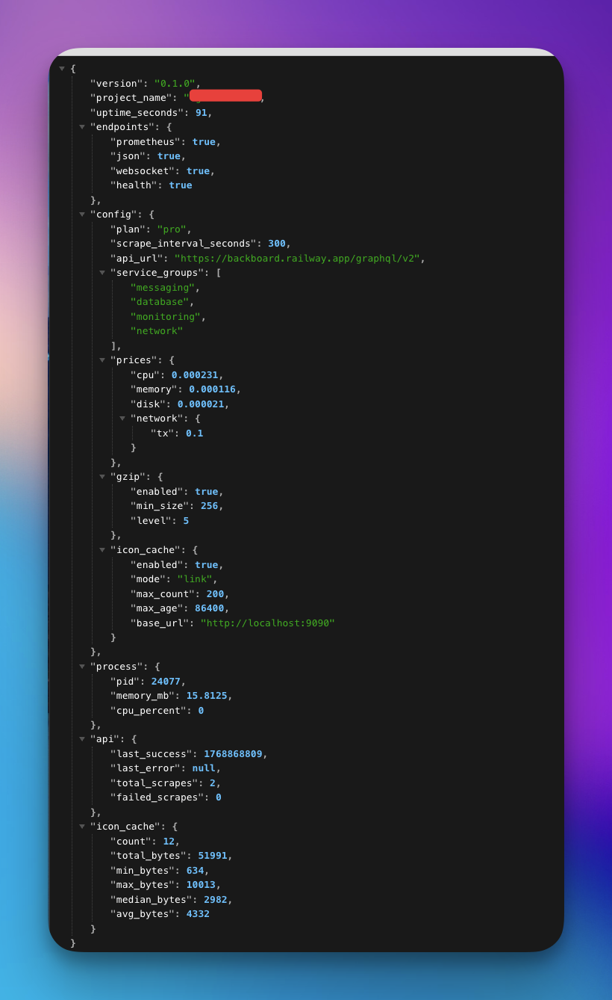
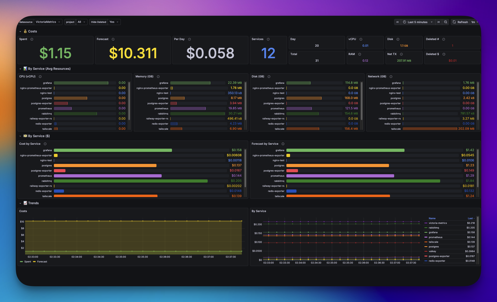
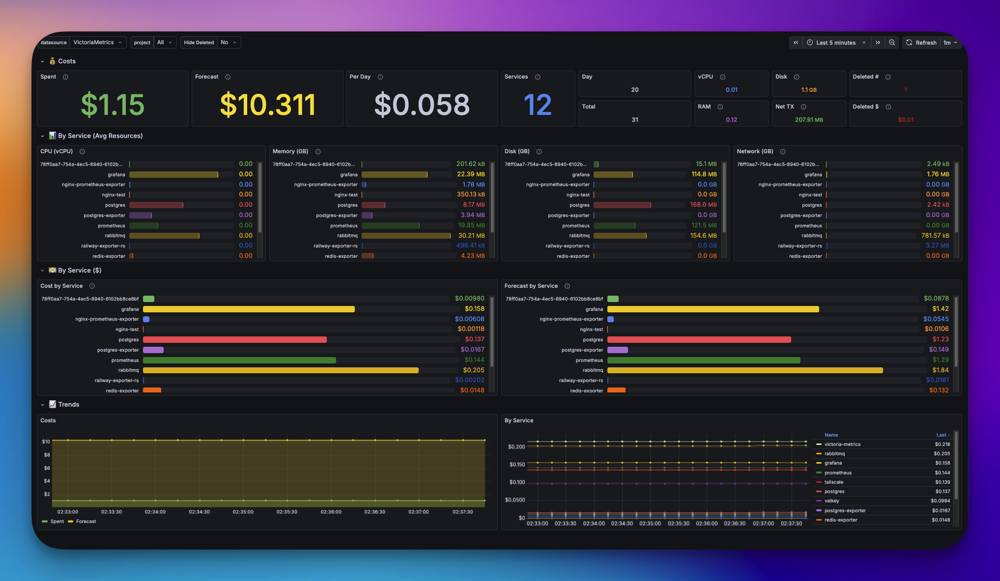

# 🚂 Railway Exporter

<p align="center">
  
</p>

<p align="center">
  <strong>Prometheus exporter for Railway.app billing and usage metrics</strong>
</p>

<p align="center">
  <a href="https://github.com/brilliant-almazov/railway-exporter-rs/actions/workflows/build.yml"></a>
  <a href="https://codecov.io/gh/brilliant-almazov/railway-exporter-rs"></a>
  <a href="https://opensource.org/licenses/MIT"></a>
  <a href="https://ghcr.io/brilliant-almazov/railway-exporter-rs"></a>
  <a href="https://www.rust-lang.org/"></a>
</p>


<p align="center">
  <a href="#-quick-start">Quick Start</a> •
  <a href="#-metrics">Metrics</a> •
  <a href="#-configuration">Configuration</a> •
  <a href="#-building-from-source">Build</a> •
  <a href="#-contributing">Contributing</a>
</p>

---

Monitor your [Railway](https://railway.app) spending in real-time with Grafana dashboards. Get alerts before your bill surprises you.

## 🎯 Why?

Railway doesn't provide Prometheus metrics out of the box. This exporter fills the gap:

| Feature | Description |
|---------|-------------|
| 💰 **Cost Tracking** | See exactly how much each service costs in real-time |
| 📈 **Forecasting** | Estimate your monthly bill before it arrives |
| 🚨 **Alerting** | Set up Prometheus alerts when costs exceed thresholds |
| 📊 **Breakdown** | Know which service is eating your budget |
| 🔄 **Self-Monitoring** | The exporter tracks its own resource usage |

## 📸 Screenshots

### SpendPulse Dashboard

Real-time cost monitoring with interactive filtering, sorting, and multi-language support.

<details>
<summary><b>🇬🇧 English Interface</b> — Default view with all services</summary>



Main dashboard showing current spend ($1.15), monthly forecast ($10.31), daily average ($0.06), and network requests (28,800). Table displays per-service breakdown with CPU, RAM, Disk, and Network metrics.
</details>

<details>
<summary><b>🇷🇺 Русский интерфейс</b> — Полная локализация</summary>



Дашборд на русском языке. Все метки, заголовки и числовые форматы адаптированы.
</details>

<details>
<summary><b>🇺🇦 Українська</b> — З фільтром по групі</summary>


Фільтрація по групі "messaging" — показує лише сервіси з обраної групи. Зверніть увагу на лічильник "Сервіси (1/7)".
</details>

<details>
<summary><b>🇮🇱 עברית (RTL)</b> — With deleted services</summary>



Right-to-left layout with "Show deleted" filter enabled. Deleted services appear with strikethrough styling and are included in totals.
</details>

<details>
<summary><b>🇮🇱 עברית (RTL)</b> — Tooltip with raw values</summary>



Hover tooltip showing precise values. Useful when displayed values are rounded (e.g., "< 0" for tiny amounts).
</details>

### Backend API

<details>
<summary><b>/status endpoint</b> — Server health and configuration</summary>



JSON response with version, uptime, endpoints status, pricing config, process info, and API scrape statistics.
</details>

### Grafana Integration (🚧 In Progress)

Pre-built Grafana dashboards for visualizing Railway metrics.

<details>
<summary><b>📊 Dashboard Overview</b> — Main metrics visualization</summary>



Grafana dashboard displaying Railway metrics from Prometheus. Shows current usage, estimated monthly costs, and per-service breakdown.
</details>

<details>
<summary><b>🔍 Query Editor</b> — PromQL queries for Railway metrics</summary>



Query editor showing how to fetch and visualize Railway metrics using PromQL. Includes examples of common queries.
</details>

## 📊 Metrics

### Per-Service Metrics

| Metric | Description |
|--------|-------------|
| `railway_cpu_usage_vcpu_minutes` | CPU usage in vCPU-minutes |
| `railway_memory_usage_gb_minutes` | Memory usage in GB-minutes |
| `railway_disk_usage_gb_minutes` | Disk usage in GB-minutes |
| `railway_network_tx_gb` | Network egress in GB |
| `railway_service_cost_usd` | Current billing period cost |
| `railway_service_estimated_monthly_usd` | Estimated monthly cost |

### Project-Level Metrics

| Metric | Description |
|--------|-------------|
| `railway_current_usage_usd` | Total current usage |
| `railway_estimated_monthly_usd` | Estimated total monthly cost |
| `railway_daily_average_usd` | Average daily spending |
| `railway_days_in_billing_period` | Days elapsed in billing period |
| `railway_days_remaining_in_month` | Days remaining in month |

### Exporter Metrics

| Metric | Description |
|--------|-------------|
| `railway_exporter_last_scrape_timestamp` | Last successful API scrape |
| `railway_exporter_scrape_duration_seconds` | API scrape duration |

## ⚙️ Configuration

Configuration is loaded from YAML file. Two methods are supported:

| Method | Environment Variable | Use Case |
|--------|---------------------|----------|
| **File** | `CONFIG_FILE` | Local development, Docker volume mount |
| **Base64** | `CONFIG_BASE64` | Docker, Kubernetes, Railway (single env var) |

**Priority:** `CONFIG_BASE64` > `CONFIG_FILE` > `./config.yaml`

### Complete config.yaml Reference

```yaml
# =============================================================================
# REQUIRED: Railway API Credentials
# =============================================================================

# API Token for authenticating with Railway GraphQL API
# How to get: https://railway.app/account/tokens
# Format: Token string (usually starts with alphanumeric characters)
# Security: Keep this token secret! Never commit to version control.
railway_api_token: "your-api-token-here"

# Project ID to monitor
# How to find:
#   1. Open your project in Railway dashboard
#   2. Go to Settings → General
#   3. Copy "Project ID" (UUID format)
# Or extract from URL: https://railway.app/project/{PROJECT_ID}
railway_project_id: "xxxxxxxx-xxxx-xxxx-xxxx-xxxxxxxxxxxx"

# =============================================================================
# REQUIRED: Project Settings
# =============================================================================

# Display name for the project
# Used in:
#   - /status endpoint JSON response
#   - Prometheus metrics labels
#   - Dashboard header (if using SpendPulse)
# If not specified, defaults to project_id value
project_name: "My Railway Project"

# Pricing plan determines cost calculation rates
# Values: "hobby" | "pro"
#
# Hobby plan rates (per minute):
#   CPU:     $0.000463/vCPU-minute
#   Memory:  $0.000231/GB-minute
#   Disk:    $0.000021/GB-minute
#   Network: $0.10/GB egress
#
# Pro plan rates (per minute) - ~50% cheaper for CPU/Memory:
#   CPU:     $0.000231/vCPU-minute
#   Memory:  $0.000116/GB-minute
#   Disk:    $0.000021/GB-minute
#   Network: $0.10/GB egress
#
# IMPORTANT: Using wrong plan will produce incorrect cost estimates!
railway_plan: pro

# =============================================================================
# OPTIONAL: Server Settings
# =============================================================================

# HTTP server port for all endpoints (/metrics, /health, /status, /ws, /api/metrics)
# Default: 9090
# Note: In Docker, use EXPOSE and port mapping (-p 9333:9090)
port: 9090

# Interval between Railway API scrapes in seconds
# Default: 300 (5 minutes)
# Valid range: 60-3600 (1 minute to 1 hour)
#
# Trade-offs:
#   Lower interval (60s):
#     + More responsive metrics
#     + Better real-time monitoring
#     - More API calls (may hit rate limits)
#     - Slightly higher resource usage
#
#   Higher interval (600s+):
#     + Fewer API calls
#     + Lower resource usage
#     - Less responsive to cost changes
#
# Recommendation: 300s for most use cases, 60s for real-time dashboards
scrape_interval: 300

# Railway GraphQL API URL
# Default: https://backboard.railway.app/graphql/v2
# Change only if Railway updates their API URL
railway_api_url: https://backboard.railway.app/graphql/v2

# Enable CORS (Cross-Origin Resource Sharing) headers
# Default: true
# When enabled, adds headers to allow requests from any origin:
#   Access-Control-Allow-Origin: *
#   Access-Control-Allow-Methods: GET, OPTIONS
#   Access-Control-Allow-Headers: Content-Type
#
# Use cases:
#   true  - Dashboard hosted on different domain (default, recommended)
#   false - Same-origin deployment or reverse proxy handles CORS
cors_enabled: true

# Enable WebSocket endpoint (/ws) for real-time updates
# Default: true
# When enabled:
#   - Clients can connect to /ws for push notifications
#   - Metrics sent immediately after each API scrape
#   - No polling needed, lower latency
#
# Protocol: WebSocket (ws:// or wss://)
# Message format: JSON with type field ("metrics" | "status")
#
# Use cases:
#   true  - Real-time dashboards, live cost monitoring
#   false - Prometheus-only setup, resource-constrained environments
websocket_enabled: true

# =============================================================================
# OPTIONAL: Service Groups
# =============================================================================

# Organize services into logical groups for filtering in dashboard
# Format: Map of group_name -> list of service name patterns
#
# Pattern matching:
#   - Case-insensitive substring match
#   - "postgres" matches "postgres", "PostgreSQL", "my-postgres-db"
#   - Order matters: first matching group wins
#   - Services not matching any pattern get "default" group
#
# Tips:
#   - Use unique substrings to avoid conflicts
#   - Group names appear in dashboard dropdown
#   - Empty list [] means the group exists but has no patterns
service_groups:
  # Infrastructure monitoring stack
  monitoring:
    - prometheus
    - grafana
    - victoria-metrics
    - loki
    - alertmanager

  # Database services
  database:
    - postgres
    - redis
    - mysql
    - mongodb
    - clickhouse

  # Message brokers and queues
  messaging:
    - rabbitmq
    - kafka
    - nats

  # Networking and proxies
  network:
    - tailscale
    - nginx
    - traefik
    - caddy

  # Application services (example)
  # backend:
  #   - api
  #   - worker
  #   - scheduler

# =============================================================================
# OPTIONAL: Gzip Compression
# =============================================================================

# HTTP response compression settings
# Reduces bandwidth usage for JSON responses
gzip:
  # Enable gzip compression
  # Default: true
  # Disable if: reverse proxy already handles compression
  enabled: true

  # Minimum response size in bytes to trigger compression
  # Default: 256
  # Rationale: Compression overhead not worth it for small responses
  # Range: 0 to any (0 = compress everything)
  #
  # Typical response sizes:
  #   /health:      ~2 bytes (no compression)
  #   /status:      ~1-2 KB (compressed)
  #   /api/metrics: ~5-50 KB depending on services (compressed)
  min_size: 256

  # Compression level (1-9)
  # Default: 1
  # MUST be between 1 and 9 (validated on startup)
  #
  # Level 1: Fastest, minimal CPU, ~60-70% compression ratio
  # Level 5: Balanced, moderate CPU, ~75-80% compression ratio
  # Level 9: Best compression, highest CPU, ~80-85% compression ratio
  #
  # Recommendations:
  #   1-3: Real-time APIs, many requests, CPU-constrained
  #   4-6: General purpose, balanced
  #   7-9: Static content, bandwidth-constrained networks
  level: 1

# =============================================================================
# OPTIONAL: Icon Cache
# =============================================================================

# Service icons are fetched from Railway API and cached locally
# Icons are SVG format, typically 1-5 KB each
icon_cache:
  # Enable icon caching
  # Default: true
  # When disabled: no icons in /api/metrics response, saves memory
  enabled: true

  # Maximum number of icons to cache (LRU eviction)
  # Default: 200
  # Memory usage: ~1-5 KB per icon, 200 icons ≈ 0.5-1 MB
  # Note: Deleted services' icons are still cached until evicted
  max_count: 200

  # Icon delivery mode
  # Default: base64
  # Values: "base64" | "link"
  #
  # MODE: base64
  #   Icons embedded as data URIs in JSON: "icon": "data:image/svg+xml;base64,..."
  #   Pros:
  #     + Single HTTP request, all data in one response
  #     + Works offline after initial load
  #     + Simpler client code
  #   Cons:
  #     - Larger JSON payload (+30-50% per icon)
  #     - Can't leverage browser image caching
  #   Best for: Simple integrations, offline-first dashboards
  #
  # MODE: link
  #   Icons served from separate endpoint: "icon": "{base_url}/static/icons/services/{name}"
  #   Pros:
  #     + Smaller JSON payload (~100 bytes per icon reference)
  #     + Browser caches icons independently
  #     + Better for slow connections
  #   Cons:
  #     - Multiple HTTP requests
  #     - Requires base_url configuration
  #   Best for: Web dashboards, bandwidth-constrained environments
  mode: base64

  # Browser cache TTL in seconds (only for mode: link)
  # Default: 86400 (1 day)
  # Adds Cache-Control header: max-age={max_age}
  #
  # Values:
  #   3600   - 1 hour (icons change frequently)
  #   86400  - 1 day (default, good balance)
  #   604800 - 1 week (icons rarely change)
  max_age: 86400

  # Base URL for icon links (required if mode: link)
  # Must include protocol and host, no trailing slash
  #
  # Examples:
  #   Local dev:     "http://localhost:9090"
  #   Production:    "https://exporter.yourdomain.com"
  #   Railway:       "https://railway-exporter-production.up.railway.app"
  #   Behind proxy:  "https://api.example.com/railway-exporter"
  #
  # Result: "{base_url}/static/icons/services/{service_name}"
  base_url: ""

# =============================================================================
# OPTIONAL: Custom Pricing (override Railway defaults)
# =============================================================================

# Override built-in pricing rates
# Use cases:
#   - Railway updates pricing (update here until exporter is updated)
#   - Custom calculations (e.g., internal cost allocation with markup)
#   - Testing with different price scenarios
#
# Format: Array of pricing entries, each with name and price values
# Note: Only the entry matching railway_plan is used for calculations
#
# Built-in defaults (as of January 2025):
pricing:
  # Hobby plan pricing
  - name: hobby
    price:
      # CPU: USD per vCPU-minute
      # 1 vCPU running for 1 hour = $0.000463 × 60 = $0.028/hour
      # 1 vCPU running for 1 month = $0.028 × 24 × 30 = ~$20/month
      cpu: 0.000463

      # Memory: USD per GB-minute
      # 1 GB RAM for 1 hour = $0.000231 × 60 = $0.014/hour
      # 1 GB RAM for 1 month = $0.014 × 24 × 30 = ~$10/month
      memory: 0.000231

      # Disk: USD per GB-minute (persistent volume)
      # 10 GB disk for 1 month = $0.000021 × 60 × 24 × 30 × 10 = ~$9/month
      disk: 0.000021

      # Network egress: USD per GB transferred out
      # Ingress is free, only outbound traffic is charged
      network:
        tx: 0.10

  # Pro plan pricing (recommended for production)
  - name: pro
    price:
      # CPU: 50% cheaper than hobby
      # 1 vCPU for 1 month = ~$10/month
      cpu: 0.000231

      # Memory: 50% cheaper than hobby
      # 1 GB RAM for 1 month = ~$5/month
      memory: 0.000116

      # Disk: same as hobby
      # 10 GB disk for 1 month = ~$9/month
      disk: 0.000021

      # Network: same as hobby
      network:
        tx: 0.10
```

### Configuration Validation

The exporter validates configuration on startup:

| Field | Validation | Error if Invalid |
|-------|------------|------------------|
| `railway_api_token` | Required, non-empty | "Missing required config: railway_api_token" |
| `railway_project_id` | Required, non-empty | "Missing required config: railway_project_id" |
| `railway_plan` | Must be "hobby" or "pro" | "Invalid plan 'X': must be 'hobby' or 'pro'" |
| `scrape_interval` | 60 ≤ value ≤ 3600 | "scrape_interval must be at least 60 seconds" |
| `gzip.level` | 1 ≤ value ≤ 9 | "gzip.level must be between 1 and 9" |

### Using Base64 Configuration

For deployments where multi-line env vars aren't supported:

```bash
# Encode config.yaml to base64
base64 -i config.yaml > config.b64

# Set environment variable
export CONFIG_BASE64=$(cat config.b64)

# Or one-liner
export CONFIG_BASE64=$(base64 -i config.yaml)
```

### Environment Variables

| Variable | Default | Description |
|----------|---------|-------------|
| `CONFIG_FILE` | `config.yaml` | Path to YAML config file |
| `CONFIG_BASE64` | — | Base64-encoded YAML config |
| `RUST_LOG` | `info` | Log level: `error`/`warn`/`info`/`debug`/`trace` |

### Configuration Effects

| Setting | Effect |
|---------|--------|
| `railway_plan` | Determines pricing rates for cost calculations |
| `scrape_interval` | Lower = fresher data but more API calls |
| `service_groups` | Enables group filtering in dashboard |
| `gzip.level` | Higher = smaller responses but more CPU |
| `icon_cache.mode: base64` | Larger JSON but fewer HTTP requests |
| `icon_cache.mode: link` | Smaller JSON, better for slow connections |
| `cors_enabled` | Required for cross-origin dashboard access |
| `websocket_enabled` | Real-time updates without polling |

## 🚀 Quick Start

### Step 1: Get Railway Credentials

1. **Get API Token:**
   - Go to [https://railway.app/account/tokens](https://railway.app/account/tokens)
   - Click "Create Token"
   - Copy the token (shown only once!)

2. **Get Project ID:**
   - Open your project in Railway dashboard
   - Click Settings → General
   - Copy the "Project ID" (UUID format)

3. **Know your plan:**
   - Check your account settings for `hobby` or `pro`

### Step 2: Create config.yaml

Create a minimal `config.yaml` file:

```yaml
# Minimal config.yaml - copy and fill in your values
railway_api_token: "your-api-token-here"
railway_project_id: "xxxxxxxx-xxxx-xxxx-xxxx-xxxxxxxxxxxx"
project_name: "My Project"
railway_plan: pro  # or "hobby"

# Optional: organize services into groups
service_groups:
  database:
    - postgres
    - redis
  monitoring:
    - grafana
    - prometheus
```

### Step 3: Run

**Option A: Docker (Recommended)**

```bash
# 1. Encode config to base64
export CONFIG_BASE64=$(base64 -i config.yaml)

# 2. Run container
docker run -d \
  --name railway-exporter \
  -p 9333:9333 \
  -e CONFIG_BASE64="$CONFIG_BASE64" \
  -e RUST_LOG=info \
  ghcr.io/brilliant-almazov/railway-exporter-rs:latest

# 3. Check it's working
curl http://localhost:9333/health
# Should return: ok

curl http://localhost:9333/status | jq .
# Should return JSON with version, config, etc.
```

**Option B: Docker with config file mount**

```bash
docker run -d \
  --name railway-exporter \
  -p 9333:9333 \
  -v $(pwd)/config.yaml:/config.yaml:ro \
  -e CONFIG_FILE=/config.yaml \
  -e RUST_LOG=info \
  ghcr.io/brilliant-almazov/railway-exporter-rs:latest
```

**Option C: Binary (local development)**

```bash
# Build from source
cargo build --release

# Run with config in current directory
./target/release/railway-exporter
# Automatically loads ./config.yaml

# Or specify config path
CONFIG_FILE=/path/to/config.yaml ./target/release/railway-exporter

# With debug logging
RUST_LOG=debug ./target/release/railway-exporter
```

### Step 4: Verify

```bash
# Health check
curl http://localhost:9333/health
# → ok

# Server status
curl http://localhost:9333/status | jq .
# → JSON with version, uptime, config

# Prometheus metrics
curl http://localhost:9333/metrics
# → Prometheus format metrics

# JSON metrics (for dashboard)
curl http://localhost:9333/api/metrics | jq .
# → JSON with project summary and services
```

### Deploy to Railway

[](https://railway.app/new/template?template=https://github.com/brilliant-almazov/railway-exporter-rs)

For Railway deployment, set the `CONFIG_BASE64` variable in service settings with your base64-encoded config.yaml.

## 🔨 Building from Source

### Prerequisites

- [Rust](https://rustup.rs/) 1.70+
- Docker (optional)

### Build and Run

```bash
# Clone repository
git clone https://github.com/brilliant-almazov/railway-exporter-rs.git
cd railway-exporter-rs

# Create config.yaml (see Configuration section above)
cp config.yaml.example config.yaml
# Edit config.yaml with your Railway credentials

# Build and run
cargo build --release
./target/release/railway-exporter
# Server starts at http://localhost:9090 (or port from config)

# Build Docker image (~6.5 MB)
docker build -t railway-exporter .

# Run Docker container
docker run -d -p 9333:9090 \
  -e CONFIG_BASE64=$(base64 -i config.yaml) \
  railway-exporter
```

### Development

```bash
cargo fmt      # Format code
cargo clippy   # Lint (catch common mistakes)
cargo test     # Run all tests (154 tests)

# Run with debug logging
RUST_LOG=debug cargo run

# Run specific test
cargo test test_health_handler
```

## 📈 Prometheus & Grafana

### prometheus.yml

```yaml
scrape_configs:
  - job_name: 'railway'
    scrape_interval: 60s
    static_configs:
      - targets: ['railway-exporter:9333']
```

### Grafana Queries

```promql
# Total cost
railway_current_usage_usd{project="my-project"}

# Monthly forecast
railway_estimated_monthly_usd{project="my-project"}

# Top 5 expensive services
topk(5, railway_service_cost_usd)

# Daily average trend
railway_daily_average_usd{project="my-project"}
```

### Alert Rule

```yaml
groups:
  - name: railway
    rules:
      - alert: RailwayHighCost
        expr: railway_estimated_monthly_usd > 50
        for: 1h
        annotations:
          summary: "Railway cost exceeds $50/month"
```

## 🔧 Architecture

```
┌─────────────────┐         ┌─────────────────┐         ┌─────────────────┐
│                 │  5 min  │                 │  scrape │                 │
│  Railway API    │◄───────►│    Exporter     │◄────────│   Prometheus    │
│  (GraphQL)      │         │   (cache)       │         │                 │
│                 │         │                 │         │                 │
└─────────────────┘         └─────────────────┘         └────────┬────────┘
                                                                 │
                                                                 ▼
                                                        ┌─────────────────┐
                                                        │                 │
                                                        │    Grafana      │
                                                        │                 │
                                                        └─────────────────┘
```

The exporter caches Railway API responses. Prometheus scrapes don't hit Railway directly.

## 💰 Cost Calculation

### Pricing Rates

| Resource | Hobby | Pro |
|----------|------:|----:|
| CPU | $0.000463/vCPU-min | $0.000231/vCPU-min |
| Memory | $0.000231/GB-min | $0.000116/GB-min |
| Disk | $0.000021/GB-min | $0.000021/GB-min |
| Egress | $0.10/GB | $0.10/GB |

### How Costs Are Calculated

Railway API returns **cumulative usage** for the billing period:

```
Service Cost = (CPU_USAGE × cpu_rate) + (MEMORY_USAGE_GB × mem_rate) +
               (DISK_USAGE_GB × disk_rate) + (NETWORK_TX_GB × egress_rate)
```

**Example (Pro plan):**
```
CPU:     15847 vCPU-min × $0.000231 = $3.66
Memory:   8234 GB-min   × $0.000116 = $0.96
Disk:      450 GB-min   × $0.000021 = $0.01
Egress:   2.34 GB       × $0.10     = $0.23
─────────────────────────────────────────────
Total:                               = $4.86
```

### Monthly Estimate

```
Estimated Monthly = Current Usage × (30 / days_elapsed)
```

See [ROADMAP.md](ROADMAP.md) for full API documentation.

## 📚 Railway Documentation

- [Railway Docs](https://docs.railway.app/)
- [API Reference](https://docs.railway.app/reference/graphql-api)
- [Pricing Details](https://railway.app/pricing)
- [Getting API Token](https://docs.railway.app/reference/graphql-api#authentication)
- [Project Settings](https://docs.railway.app/guides/projects)

## 🌐 Endpoints

| Endpoint | Description |
|----------|-------------|
| `GET /metrics` | Prometheus metrics |
| `GET /health` | Health check |

## 🤝 Contributing

Contributions welcome! See [CONTRIBUTING.md](CONTRIBUTING.md).

## 📄 License

[MIT](LICENSE) © Anton Brilliantov

---

<p align="center">
  Made with ❤️ and 🦀
</p>
